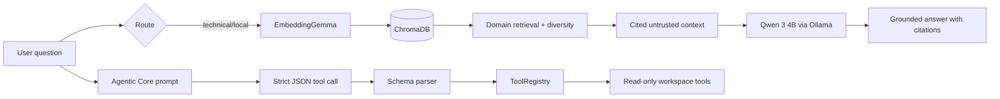

# Local Agentic RAG

Secure local RAG and agentic AI engineering system powered by Qwen, Ollama, EmbeddingGemma and ChromaDB.


## Executive Summary

Local Agentic RAG is a local-first engineering system for retrieval-augmented generation and early agentic tool routing. It combines a local Qwen 3 4B model served through Ollama, EmbeddingGemma embeddings, and a persistent ChromaDB collection built from a governed technical corpus.

The project is intentionally conservative. The RAG path is the mature center: domain-aware retrieval, overfetching, source diversity, per-source chunk limits, traceable citations, and prompt-injection-aware answer generation. The Agentic Core is a read-only prototype: it asks Qwen to choose one tool through a strict JSON contract, validates the response, and executes only sandboxed workspace inspection tools.

## Current Status

Implemented:

- Local technical RAG over a ChromaDB collection named `ai_engineering_knowledge`.
- Qwen 3 4B local generation through Ollama.
- EmbeddingGemma query/document embeddings.
- Corpus report with 84 documents and 757 generated chunks.
- Domain routing for Python, PyTorch, Machine Learning, Deep Learning, MLOps, LLMOps, Reinforcement Learning, Cybersecurity, Linux Security, ML Security, and AI Security.
- Retrieval overfetch, source diversity, max chunks per source, citations, and global fallback.
- Indirect prompt-injection guardrails that treat retrieved context as untrusted evidence.
- Strict JSON tool-call parsing for a read-only Agentic Core.
- Workspace-confined tools: `list_directory`, `read_file`, `search_code`, and `git_status`.
- pytest tests, Ruff lint/format configuration, local validation script, and GitHub Actions CI.

Not implemented yet:

- Autonomous coding agent loop.
- Write tools or automatic patch application.
- Persistent agent memory.
- Multi-agent orchestration.
- Real web search provider adapter.
- GPU or Ollama-dependent CI.

## Architecture



The architecture has two related but separate flows:

- RAG flow: retrieves technical context, builds cited evidence, and asks Qwen to answer from that evidence.
- Agentic flow: routes a task into a single validated read-only tool call and returns structured results.

See [docs/architecture.md](docs/architecture.md) for component boundaries and data flow.

## RAG Flow

1. The user asks a technical question.
2. The query is embedded with EmbeddingGemma through Ollama.
3. The retriever infers a domain from transparent keyword routing when possible.
4. ChromaDB is queried with overfetching, then chunks are deduplicated and diversified.
5. A global fallback runs when a domain-specific query returns too few chunks.
6. Context is formatted with `[Fonte N]` citations and metadata.
7. Qwen answers using the retrieved context as evidence, not instructions.

Vector distance is a ranking signal, not a probability. A low distance does not prove truth, and a high-ranking chunk can still be stale, incomplete, poisoned, or only partially relevant.

## Agentic Flow

The Agentic Core is intentionally narrow:

1. `build_tool_prompt()` asks Qwen to produce JSON only.
2. Ollama is called with `think: false`, `format: json`, and temperature `0.0`.
3. `parse_tool_call()` rejects Markdown fences, invalid JSON, unknown tools, missing fields, extra fields, and malformed final answers.
4. `ToolRegistry` executes only implemented read-only tools.
5. Path policy prevents directory traversal outside the configured workspace.

The current system is a proto-agent for safe inspection. It is not a full coding agent.

## Security

Security defaults:

- Local-first retrieval for private/project context.
- Deny-by-default tool execution.
- Read-only filesystem and Git tools.
- Workspace path resolution with traversal rejection.
- No shell execution in Agentic Core tools except fixed `git status` arguments.
- Subprocess calls use argument lists and timeouts.
- Retrieved content is treated as untrusted data.
- Local ChromaDB, logs, model weights, checkpoints, and environment files are ignored by Git.

Threats covered in docs include prompt injection, indirect prompt injection, RAG poisoning, unsafe tool calls, path traversal, secrets exposure, excessive agency, and repository boundary escapes.

See [docs/security-model.md](docs/security-model.md) and [docs/threat-model.md](docs/threat-model.md).

## Tool Calling

Tool calls must be a single JSON object:

```json
{
  "tool": "read_file",
  "arguments": {"path": "README.md"},
  "reason": "Inspect project overview."
}
```

Supported Agentic Core tools:

- `list_directory`
- `read_file`
- `search_code`
- `git_status`
- `final_answer`

The schema enum also names planned tools such as `query_rag`, `run_tests`, and `run_linter`, but those do not have executors yet. The registry raises a controlled error for tools that are not implemented.

## Corpus Domains

- Python
- PyTorch
- Machine Learning
- Deep Learning
- MLOps
- LLMOps
- Reinforcement Learning
- Cybersecurity
- Linux Security
- ML Security
- AI Security

The corpus is stored under `data/raw/`. The local vector database under `data/chroma/` is intentionally not tracked.

## Repository Structure

```text
.
├── README.md
├── SECURITY.md
├── CONTRIBUTING.md
├── CODE_OF_CONDUCT.md
├── LICENSE
├── Makefile
├── pyproject.toml
├── .env.example
├── .github/workflows/ci.yml
├── docs/
├── scripts/
├── src/
│   ├── agent/
│   ├── corpus/
│   ├── qwen_training/
│   └── rag/
├── tests/
└── data/
    └── raw/
```

## Quick Start

Install dependencies:

```bash
uv sync --dev
```

Configure local environment:

```bash
cp .env.example .env
```

Pull local models in Ollama:

```bash
ollama pull qwen3:4b
ollama pull embeddinggemma
```

## Ollama Configuration

Recommended local runtime posture:

- Keep only one model loaded when working on a constrained GPU.
- Set model parallelism to `1`.
- Unload inactive models after a short idle period, for example five minutes.
- Avoid CI workflows that require Ollama, GPU access, or model downloads.

The code defaults are:

```text
OLLAMA_BASE_URL=http://localhost:11434
CHAT_MODEL=qwen3:4b
EMBEDDING_MODEL=embeddinggemma
CHROMA_DIR=data/chroma
COLLECTION_NAME=ai_engineering_knowledge
```

## Ingestion

Build or rebuild the local technical ChromaDB collection:

```bash
uv run python -m src.rag.ingest_technical --rebuild
```

This writes local vector database files under `data/chroma/`, which are ignored by Git.

## Technical Chat

Run the technical RAG chat:

```bash
uv run python -m src.rag.chat_technical
```

Run the routed research agent:

```bash
uv run python -m src.rag.agent.router "Explique prompt injection indireto nos documentos locais"
```

Disable local JSONL logs:

```bash
uv run python -m src.rag.agent.router --no-log "Explique RAG poisoning"
```

## Tests and Quality

```bash
make format
make lint
make test
make validate
make check
```

Equivalent direct commands:

```bash
uv run ruff format .
uv run ruff check .
uv run pytest
uv run python scripts/validate_repository.py
git diff --check
```

## Evaluation

Run deterministic routing evaluation:

```bash
uv run python -m src.rag.agent.evaluate
```

The current evaluation is offline and fixture-based. It validates route selection, source metadata, JSONL logging shape, and citation coverage without requiring Ollama, ChromaDB, GPU, or network access.

Recommended benchmark metrics are documented in [docs/evaluation.md](docs/evaluation.md).

## Limitations

- Retrieval quality depends on corpus coverage, chunking, metadata quality, and embedding behavior.
- Top-k retrieval can miss relevant chunks.
- Domain routing is heuristic and can misclassify mixed or ambiguous questions.
- ChromaDB distance is not confidence or correctness.
- The local model can still produce unsupported claims; the prompt requires it to identify insufficient context.
- The Python path in the routed research agent is a constrained helper, not a hardened production sandbox.
- The Agentic Core executes only read-only tools and does not patch code.

## Threat Model

Primary protected assets are local files, secrets, vector database contents, model artifacts, repository integrity, and user intent. Main attack surfaces are retrieved text, LLM output, tool-call JSON, path arguments, subprocess usage, logs, and versioned artifacts.

See [docs/threat-model.md](docs/threat-model.md) for detailed assets, actors, mitigations, and residual risks.

## Roadmap

The roadmap progresses from local RAG to safe coding-agent behavior:

- Phase 0: Local RAG
- Phase 1: Strict tool routing
- Phase 2: Read-only tool execution
- Phase 3: Observation-action loop
- Phase 4: Safe patches
- Phase 5: Test and lint execution
- Phase 6: Git-aware coding agent
- Phase 7: Episodic memory
- Phase 8: Evaluation harness
- Phase 9: Sandboxed autonomous workflows

See [docs/roadmap.md](docs/roadmap.md).

## Contributing

Contributions should preserve the local-first and security-first posture. Do not submit secrets, vector databases, model weights, generated logs, hardware-specific paths, or private environment files.

See [CONTRIBUTING.md](CONTRIBUTING.md).

## License

MIT. See [LICENSE](LICENSE).
