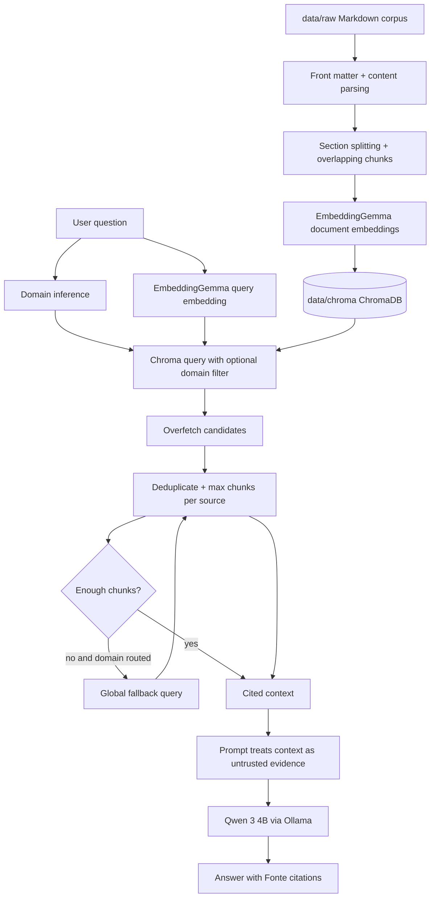
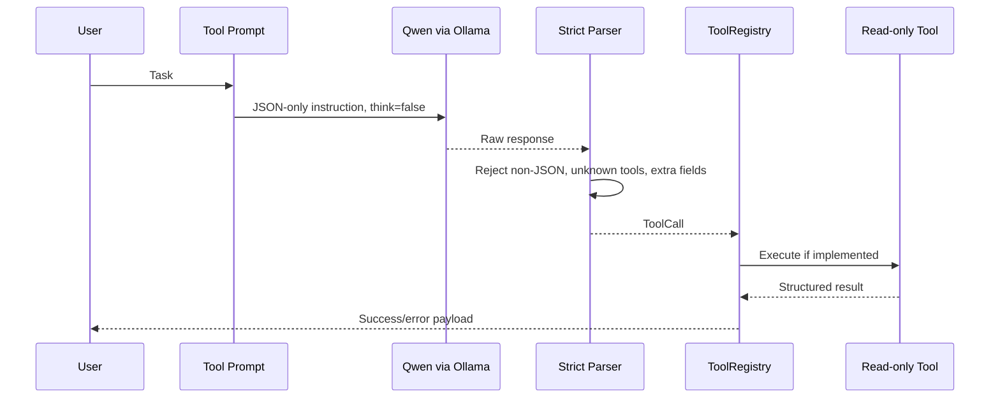
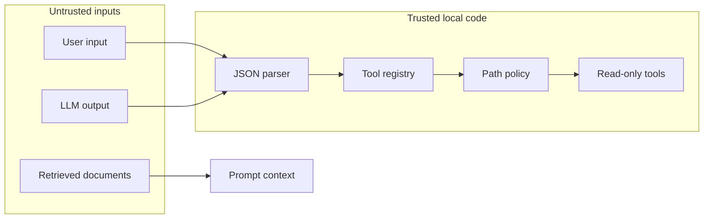

# Architecture

Local Agentic RAG has two cooperating layers:

- A local technical RAG pipeline for grounded answers over a governed corpus.
- A read-only Agentic Core prototype for strict JSON tool routing.

The implementation is local-first and keeps untrusted model output away from privileged actions.

## Components

| Component | Path | Responsibility |
| --- | --- | --- |
| Technical chat | `src/rag/chat_technical.py` | Domain-aware ChromaDB retrieval, context formatting, Qwen answer generation, citations. |
| Ingestion | `src/rag/ingest_technical.py` | Markdown discovery, metadata parsing, chunking, EmbeddingGemma embedding, ChromaDB writes. |
| Routed research agent | `src/rag/agent/router.py` | Policy-based routing among local RAG, web abstraction, Python helper, and clarification. |
| Source policy | `src/rag/agent/policy.py` | Transparent heuristics for local, web, recent, Python, and ambiguous queries. |
| Source model | `src/rag/agent/sources.py` | Normalized source metadata and cited context formatting. |
| Agent model adapter | `src/agent/core/model.py` | Qwen/Ollama call for strict tool-call routing with thinking disabled. |
| Tool schema | `src/agent/schemas/tool_call.py` | JSON parsing, tool enum, field validation, final-answer validation. |
| Path policy | `src/agent/policies/paths.py` | Workspace confinement and directory traversal rejection. |
| Tool registry | `src/agent/tools/registry.py` | Maps validated tool calls to implemented read-only executors. |
| Filesystem tools | `src/agent/tools/filesystem.py` | Safe list, read, and text search within the workspace. |
| Git tool | `src/agent/tools/git.py` | Fixed-argument `git status --short --branch` with timeout. |

## Data Flow

## Agentic Core Flow

## Trust Boundaries

Retrieved content and model output are not trusted. The system may use them as evidence or proposed actions, but local deterministic code validates and constrains them before execution.

## RAG Pipeline Responsibilities

- Domain routing reduces search space for known technical domains.
- Overfetching retrieves more candidates than final `top_k`.
- Source diversity prevents one source from dominating the final context.
- The max-chunks-per-source limit is currently `2`.
- Global fallback helps when a domain-specific filter is too narrow.
- Citations preserve traceability to source metadata.

## Tool Routing Responsibilities

- `think: false` keeps the Qwen router output closer to deterministic JSON.
- `format: json` requests JSON mode from Ollama.
- `parse_tool_call()` enforces exact top-level fields: `tool`, `arguments`, and `reason`.
- `ToolRegistry` exposes only implemented read-only tools.
- Planned tools in the enum are not executable until registry handlers exist.

## Current Limits

- No write tools.
- No autonomous observe-act loop.
- No persistent memory.
- No production sandbox for arbitrary Python execution.
- No live web provider configured by default.
- CI does not run Ollama, download models, or require GPU access.
